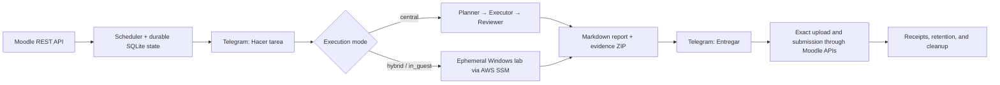

# moodle-autotask

[](https://github.com/0xg00/moodle-autotask/actions/workflows/ci.yml)
[](https://github.com/0xg00/moodle-autotask/releases/latest)
[](https://www.python.org/)
[](LICENSE)

> Approval-gated Moodle task automation with Telegram, isolated Codex agents, and ephemeral AWS labs.

`moodle-autotask` connects to Moodle through its official mobile REST API, discovers assignment
revisions and attachments, asks a human for permission in Telegram, and produces a reviewed
Markdown report with verifiable evidence. A separate approval is required before the exact report
is submitted to Moodle.

The project is designed around a simple rule: **discovery is not approval, execution is not
submission, and every irreversible boundary must be explicitly authorized and digest-bound.**

## Why this project exists

Automating an LMS task is easy to prototype and difficult to make safe. Network retries, changed
assignments, duplicated callbacks, stale virtual machines, partial uploads, and unbounded evidence
can all turn a useful script into an unreliable or expensive system.

This repository implements the full lifecycle instead of hiding those failure modes:

- exact Moodle task and revision identities;
- durable Telegram approvals for execution and submission;
- isolated planner, executor, and reviewer roles;
- deterministic reports, manifests, and evidence bundles;
- idempotent AWS provisioning and teardown;
- crash-safe outboxes, leases, retention, and storage quotas;
- least-privilege infrastructure with health and cost alarms.

## How it works



### Approval checkpoints

1. **Hacer tarea** binds the user decision to the exact task, assignment revision, and execution
   specification.
2. The selected execution path produces a reviewed report and immutable provenance.
3. **Entregar** or **Acepto y entregar** binds a second decision to the exact report manifest and,
   when Moodle requires it, the exact submission statement.
4. Only then does the connector upload, save, finalize, and verify the submitted file.

### Execution modes

| Mode | Intended workload | Compute boundary |
| --- | --- | --- |
| `central` | Ordinary assignments that need no guest machine | Three fresh, stateless Linux roles: planner, executor, reviewer |
| `hybrid` | Lab-oriented assignments and verified lab artifacts | Capability-limited controller plus one ephemeral Windows lab |
| `in_guest` | Approved virtual-appliance work | Exact OVA import and execution inside the resulting owned Windows image |

The mode is selected deterministically from the approved assignment snapshot. Virtual-disk inputs
fail closed; the currently supported appliance route requires exactly one `.ova` and never replaces
it with a blank machine.

## Safety model

### Moodle boundary

- Uses official Moodle mobile web-service functions; no scraping or browser automation.
- Accepts an opaque mobile token from protected local/runtime storage, never from a CLI argument.
- Revalidates site identity, assignment ID, revision, policy, and attachment metadata before work
  and again before submission.
- Uploads exactly one digest-bound Markdown report and verifies the remote receipt.
- Handles Moodle drafts, required submission statements, and response-loss recovery without blind
  duplicate mutations.

### Agent boundary

- Codex runs as a dedicated unprivileged Linux user.
- A root-owned policy blocks direct access to application secrets, authentication material, AWS
  instance credentials, and tool network access.
- Planner output grants no commands or cloud capability.
- Reviewer input is structurally and provenance validated, but all model-authored text remains
  untrusted evidence rather than an instruction.
- Central artifacts are regular-file-only, path bounded, size bounded, and packaged in a
  deterministic ZIP whose SHA-256 is part of the result provenance.

### AWS boundary

- The persistent controller has no inbound security-group rules and is administered through AWS
  Systems Manager.
- The controller instance role cannot directly provision EC2 labs or mutate IAM; it can assume
  only narrowly scoped lab and image-import roles.
- Guest instances receive Systems Manager permissions only and cannot read Moodle or controller
  secrets.
- EventBridge and Lambda independently reap stale, exactly tagged labs.
- CloudWatch, SNS, and an encrypted SQS failure queue cover controller health, reaper failures,
  missing invocations, throttles, and storage admission.

### Storage and recovery

- SQLite outboxes and leases are deliberately at least once and use stable event IDs.
- Agent workspaces live on a dedicated root-owned ext4 filesystem with `nodev,nosuid`.
- Admission locks and byte/inode quotas prevent concurrent overcommit.
- Two-phase retention coordinates controller-owned jobs and agent-owned workspaces, results, and
  bundles without weakening Unix ownership boundaries.
- Scratch data expires after 24 hours; retained evidence expires after seven days. Every scan and
  mutation is bounded and replay safe.

## What it deliberately does not do

- It does not log in with a Moodle password.
- It does not scrape Moodle or automate a browser.
- It does not start work merely because a notification was delivered.
- It does not submit a report merely because execution succeeded.
- It does not allow Moodle text to choose IAM roles, AMIs, instance types, networks, or volume
  sizes.
- It does not keep Windows labs alive indefinitely.
- It is not affiliated with or endorsed by Moodle, OpenAI, Telegram, or AWS.

## Project status

The current public release is [`v0.1.0`](https://github.com/0xg00/moodle-autotask/releases/tag/v0.1.0).
It has been validated with:

- Python 3.11, 3.12, and 3.13 CI;
- strict Ruff and mypy checks;
- Terraform formatting and validation;
- Linux root/two-UID ownership, crash, corruption, quota, and concurrency matrices;
- a pinned Moodle 5.2.1 Docker integration environment;
- a real end-to-end Moodle → Telegram → agents → approval → Moodle submission.

This is a reference implementation, not a hosted service. Running the AWS path creates billable
resources and requires an operator who understands the documented IAM and cleanup boundaries.

## Quick start for contributors

### Requirements

- Python 3.11–3.13
- Git
- Docker Desktop and PowerShell 5.1+ for the local Moodle integration environment
- Terraform 1.15.x and AWS CLI v2 only for the optional AWS deployment

### Install and verify

```bash
git clone https://github.com/0xg00/moodle-autotask.git
cd moodle-autotask
python -m venv .venv
```

Activate the virtual environment:

```powershell
.\.venv\Scripts\Activate.ps1
```

or on a POSIX shell:

```bash
source .venv/bin/activate
```

Then install and run the complete developer gate:

```bash
python -m pip install -e ".[dev]"
python -m ruff check .
python -m mypy src tests
python -m pytest -q
```

The canonical Python distribution and import namespace are `moodle-autotask` and
`moodle_autotask`. The `v0.1.0` source archive used the misspelled experimental namespace
`moddle_autotask`; it was corrected before publishing a Python package registry release.

## Local Moodle integration

The development stack uses pinned official Moodle and `moodle-docker` sources, PostgreSQL, and a
deterministic fictitious ASIX fixture. It binds to loopback by default; a validated private/Tailscale opt-in
is documented for explicitly private access, and it must never be exposed to the public internet.

```powershell
powershell -NoProfile -ExecutionPolicy Bypass -File scripts/moodle.ps1 -Action Bootstrap
powershell -NoProfile -ExecutionPolicy Bypass -File scripts/moodle.ps1 -Action Smoke
powershell -NoProfile -ExecutionPolicy Bypass -File scripts/moodle.ps1 -Action Status
```

Bootstrap is idempotent and stores generated tokens, runtime checkouts, plans, and evidence only
under ignored `.runtime/` paths. See [Local Moodle environment](docs/local-moodle.md) for source
pins, fixture states, reset behavior, and private/Tailscale binding rules.

## AWS deployment

The Terraform baseline is intentionally split into remote-state bootstrap and controller stacks.
Do not apply it from example values without reading the full runbook and reviewing every plan.

Start with [AWS controller and operations](docs/aws.md). It covers:

- SSO and account guardrails;
- state bootstrap and controller planning;
- scheduler scope configuration;
- secret upload outside Terraform;
- commit/digest-bound deployment over Systems Manager;
- activation, status, smoke, rollback, alarms, retention, and recovery.

No Windows lab is launched by `terraform apply`; labs are created only after an approved application
workflow. AWS usage can incur costs.

## Repository map

| Path | Purpose |
| --- | --- |
| `src/moodle_autotask/domain/` | Provider-neutral identities, lifecycle values, and state transitions |
| `src/moodle_autotask/application/` | Approval-aware orchestration and ports |
| `src/moodle_autotask/adapters/moodle/` | Moodle REST, scheduler, Telegram, state, and submission adapters |
| `src/moodle_autotask/adapters/aws/` | Controller, lab, agent spool, protocols, quotas, and retention |
| `infra/moodle/` | Pinned deterministic Moodle fixture and catalog |
| `infra/aws/` | Terraform bootstrap and controller infrastructure |
| `scripts/` | Local Moodle, AWS deployment, and central E2E entry points |
| `tests/` | Unit, integration, hostile-input, crash, ownership, and executable harness tests |
| `docs/` | Architecture and operational runbooks |

For the deeper trust model and lifecycle invariants, read [Architecture](docs/architecture.md).

## Responsible use

Use this project only with Moodle sites, courses, assignments, and cloud accounts you are authorized
to access. The operator remains responsible for reviewing generated work, respecting academic and
organizational policies, controlling costs, and deciding whether a report should be submitted.

## Contributing and security

- Read [CONTRIBUTING.md](CONTRIBUTING.md) before opening a PR.
- Report vulnerabilities through [GitHub private vulnerability reporting](https://github.com/0xg00/moodle-autotask/security/advisories/new),
  not a public issue.
- See [SECURITY.md](SECURITY.md) for the trust boundaries and reporting policy.

## License

Licensed under the [Apache License 2.0](LICENSE).
